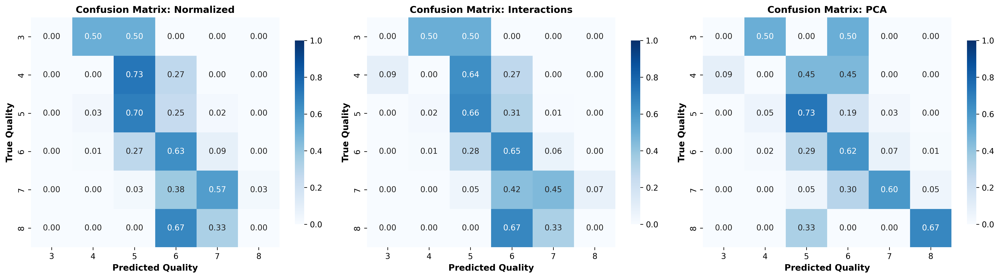

# Section 3: Methods

## 3.1 Support Vector Machine Method

Support Vector Machine (SVM) is a powerful classification method that seeks to find an optimal separating hyperplane by maximizing the margin between different classes. Given a training data set $\mathcal{D} = \{(\boldsymbol{x}_i, y_i)\}_{i=1}^N$, where $\boldsymbol{x}_i \in \mathcal{R}^d$ and $y_i \in \{-1, +1\}$ for binary classification, we seek a linear model classifier in the form:

$$y(\boldsymbol{x}) = \boldsymbol{w}^T \boldsymbol{\phi}(\boldsymbol{x}) + b$$

where $\boldsymbol{\phi}(\boldsymbol{x})$ denotes a fixed feature-space transformation, $\boldsymbol{w}$ is the weight vector, and $b$ is the bias parameter. For a binary linearly separable data set, there exists at least one choice of $\boldsymbol{w}$ and $b$ that satisfies:

$$y_i(\boldsymbol{w}^T \boldsymbol{\phi}(\boldsymbol{x}_i) + b) > 0, \quad i = 1, \ldots, N$$

The margin of a hyperplane is defined as the geometric distance of the closest point in the data set to the hyperplane, given by:

$$\gamma = \min_i \frac{y_i(\boldsymbol{w}^T \boldsymbol{\phi}(\boldsymbol{x}_i) + b)}{\|\boldsymbol{w}\|}$$

Since rescaling of $\boldsymbol{w}$ and $b$ does not change the hyperplane, we can use this freedom to produce constraints such that the margin becomes $\gamma = 1/\|\boldsymbol{w}\|$. The maximum margin solution is found by solving the optimization problem:

$$\arg \min_{\boldsymbol{w}, b} \frac{1}{2}\|\boldsymbol{w}\|^2$$

subject to:

$$y_i(\boldsymbol{w}^T \boldsymbol{\phi}(\boldsymbol{x}_i) + b) \geq 1, \quad i = 1, 2, \ldots, N$$

This is a quadratic programming problem. For non-linearly separable data sets, we extend this to the soft margin formulation by introducing slack variables $\xi_i \geq 0$:

$$\arg \min_{\boldsymbol{w}, b, \boldsymbol{\xi}} \frac{1}{2}\|\boldsymbol{w}\|^2 + C \sum_{i=1}^N \xi_i$$

subject to:

$$y_i(\boldsymbol{w}^T \boldsymbol{\phi}(\boldsymbol{x}_i) + b) \geq 1 - \xi_i, \quad \xi_i \geq 0, \quad i = 1, 2, \ldots, N$$

where $C > 0$ is a regularization parameter that controls the trade-off between maximizing the margin and minimizing classification errors.

**Implementation:** We implement SVM using scikit-learn's `SVC` class with a radial basis function (RBF) kernel, defined as $k(\boldsymbol{x}, \boldsymbol{x}') = \exp(-\gamma \|\boldsymbol{x} - \boldsymbol{x}'\|^2)$, which allows for non-linear decision boundaries. For our multi-class wine quality classification problem (6 classes: quality scores 3-8), we use the one-versus-rest (OvR) strategy, training one binary classifier per class.

We evaluate SVM performance on three preprocessed datasets: (1) the normalized baseline dataset (11 features), (2) the dataset with interaction features (18 features), and (3) the PCA-transformed dataset (9 principal components retaining 95% variance). For each dataset, we perform an 80-20 train-test split using stratified sampling to preserve class distribution.

Hyperparameter tuning is performed using grid search with 5-fold cross-validation. For each parameter combination, the model is trained on 4 folds and validated on the remaining fold, repeating this process 5 times. The combination yielding the highest average cross-validation macro F1-score is selected as optimal. Grid search optimizes for macro F1-score rather than accuracy to address class imbalance in the dataset. Macro F1-score gives equal weight to all classes, ensuring the model performs well across both majority and minority classes, rather than optimizing primarily for classes 5 and 6 which contain most of the data.

The regularization parameter $C$ is evaluated over $\{0.1, 1, 10, 100\}$, controlling the trade-off between maximizing the margin and minimizing classification errors. Larger values (e.g., 100) penalize misclassifications more heavily, resulting in a smaller margin but fewer training errors, while smaller values (e.g., 0.1) prioritize a larger margin for better generalization.

The kernel parameter $\gamma$ is evaluated over $\{\text{'scale'}, \text{'auto'}, 0.001, 0.01, 0.1, 1\}$, determining the influence of training examples on the decision boundary. When $\gamma = \text{'scale'}$, it is computed as $\gamma = 1/(n_{\text{features}} \times \text{var}(X))$, adapting to both dimensionality and data scale. When $\gamma = \text{'auto'}$, it is set to $\gamma = 1/n_{\text{features}}$, considering only the number of features. Numeric values are fixed, with larger values (e.g., 1) creating more complex, localized boundaries and smaller values (e.g., 0.001) producing smoother, more generalized boundaries.

This parameter grid results in $4 \times 6 = 24$ unique combinations evaluated per dataset. The best model from cross-validation is evaluated on the held-out test set. Performance is assessed using accuracy, macro F1-score, precision, recall, and confusion matrices, with both test set and cross-validation results (mean macro F1-score ± standard deviation) reported to assess model stability.

# Section 4: Results and Analysis

## 4.1 Support Vector Machine Results

We evaluate SVM performance across three preprocessed datasets to assess the impact of different feature representations on classification performance. Table 1 summarizes the performance metrics for each dataset.

**Table 1: SVM Performance Comparison Across Datasets**

| Dataset | Accuracy | Macro F1-Score | CV Macro F1 (mean ± std) | Best C | Best gamma |
|---------|----------|----------------|---------------------------|--------|------------|
| Normalized | 0.622 | 0.316 | 0.363 ± 0.061 | 10 | 0.1 |
| PCA | 0.638 | 0.410 | 0.364 ± 0.081 | 100 | auto |
| Interactions | 0.616 | 0.383 | 0.349 ± 0.081 | 100 | 0.1 |

The PCA-transformed dataset achieves the highest macro F1-score of 0.410, followed by the interactions dataset (0.383) and the normalized baseline (0.316). The macro F1-score calculates the F1-score for each class independently and then averages them with equal weight, making it particularly important for imbalanced datasets as it ensures all classes contribute equally to the overall metric. This optimization strategy prioritizes balanced performance across all quality classes rather than maximizing accuracy on the majority classes (5 and 6).

While PCA achieves the best macro F1-score, it also shows higher variability in cross-validation results (standard deviation of 0.081). The normalized dataset provides the most stable performance (standard deviation of 0.061), though with lower macro F1-score. The interactions dataset shows intermediate performance in both macro F1-score and stability (standard deviation of 0.081).

The optimal hyperparameters vary across datasets: PCA and interactions both benefit from stronger regularization ($C=100$), while normalized performs best with moderate regularization ($C=10$). For the $\gamma$ parameter, normalized uses $\gamma=0.1$, interactions uses $\gamma=0.1$, and PCA uses $\gamma=\text{'auto'}$, which automatically sets $\gamma = 1/n_{\text{features}}$ based on the number of features. A detailed analysis of class-wise performance, including confusion matrices, is provided in the appendix (Figure A1).

\newpage

## Appendix: Additional SVM Visualizations

### A1. Confusion Matrices for SVM

*Figure A1: Confusion Matrices for SVM - Left: Normalized dataset; Middle: Interactions dataset; Right: PCA dataset*

The confusion matrices reveal consistent patterns across all three datasets. The model performs well on the majority classes (quality 5 and 6), which together represent approximately 82% of the dataset. However, the model struggles significantly with minority classes (quality 3, 4, and 8), achieving near-zero precision and recall for these classes. This reflects the class imbalance inherent in the dataset, where quality scores 3, 4, and 8 represent only 0.6%, 3.3%, and 1.1% of samples, respectively.

For the normalized dataset, the model correctly classifies approximately 70% of quality 5 samples and 63% of quality 6 samples. The PCA dataset shows similar performance with approximately 73% correct classifications for quality 5 and 62% for quality 6, and achieves the best performance for quality 7 with 60% correct classifications. The interactions dataset correctly classifies approximately 73% of quality 5 samples and 58% of quality 6 samples.

A common pattern across all datasets is confusion between adjacent quality levels, particularly between classes 5 and 6. The normalized dataset misclassifies approximately 25% of true quality 5 samples as quality 6, and 27% of true quality 6 samples as quality 5. The PCA dataset shows approximately 19% misclassifications of quality 5 as 6, and 29% misclassifications of quality 6 as 5. The interactions dataset exhibits the highest confusion between these classes, with approximately 20% misclassifications of quality 5 as 6, and 34% misclassifications of quality 6 as 5. This pattern suggests that distinguishing between adjacent quality levels remains challenging even with macro F1 optimization.

The model's conservative predictions for class 7 (approximately 55-60% correct classifications across datasets) further highlight the challenge of distinguishing between adjacent quality levels. Classes 3, 4, and 8 show near-complete misclassification, with most instances being predicted as adjacent classes (primarily 4, 5, or 6).
